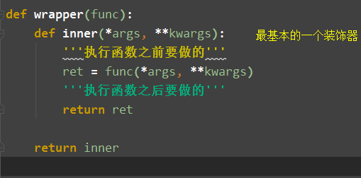
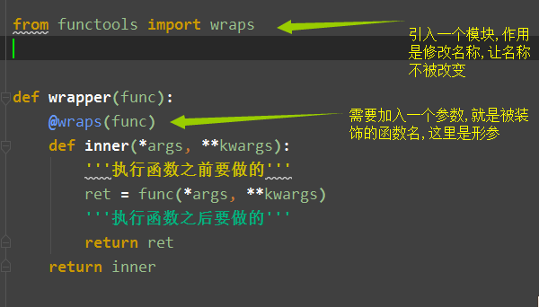
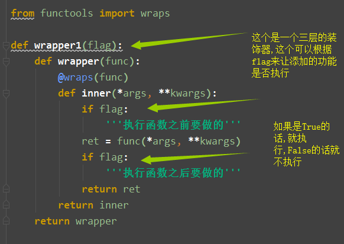

### 装饰器

**1.什么是装饰器**

- **装饰器的本质**就是一个pyhon函数(也可称为**闭包**),他可以让其他函数在不需要更改任何代码的前提下,增加额外的功能,装饰器的返回值也是一个函数对象 
- **应用场景**:插入日志,性能测试,事务处理,缓存等等场景 

**2.开放封闭原则**

- 1.对扩展开放
- 2.对修改封闭

**3.装饰器的主要功能和固定结构**

**第一种:基本装饰器**

**第二种:保证函数名不被改变**

**第三种:带参数的装饰器**

### 迭代器

**迭代器分两种**

1. 调用方法直接返回的 
2. 可迭代对象通过执行iter方法得到的 

**什么是可迭代对象** 

- 字符串,列表,元祖,字典,集合都可以被for循环的,说明他们都是可迭代的 

**可迭代协议**

- 可以被迭代要求的满足就叫做可迭代协议,,可迭代协议的定义就是,内部实现__iter__方法的
- 可迭代的:内部必须含有__iter__方法

**迭代器**

- 迭代器遵循迭代器协议:必须拥有__iter__方法和__next方法 
- for循环,能遍历每个可迭代对象,他的内部发生了什么 
	- 将可迭代对象转化为迭代器(可迭代对象.___iter__()) 
	- 内部使用__next__方法,一个一个取值 
	- 加了异常处理,取值到底自动停止 
- 为什么有for循环
	- 因为像字符串,列表,元祖,这些都有下标的,可以按照索引来取,但是向那些字典,集合等等没有下标的,他就需要把这些转换成一个迭代器,来把数据全部取出来,再循环的同时,同一时刻在内存中只出现一条数据,这也极大限度的节省了内存 
- 迭代器的优点
	- 1.节省内存
	- 2.惰性机制
	- 3.单项不可逆

### 生成器

**1.生成器的概念**

- **1.python提供的生成器**:常规函数的定义,但是,使用yield语句而不是return语句返回结果,yield语句一次返回一个结果,在每个结果中间,挂起函数的状态,以便下次从他离开的地方继续执行 
- **2.生成器表达式**:类似于列表推导式,但是生成器返回按需产生结果的一个对象,而不是一个结果列表 
- 3.生成器
	- 本质:迭代器(所以自带__iter__和__next__方法,不需要我们去实现) 
	- 特点:惰性运算,开发者自定义 

**2.生成器函数**

- 一个包含yield关键字的函数就是一个生成器函数 

**3.send**

- 1.send的效果和next一样,只是获取下一个值的时候可以给上一个yield赋值 
- 使用send注意事项 
	- 1.第一次使用生成器的时候,用next获取下一个值
	- 2.最后一个yield不能接受外部值

### 列表推导式和生成器表达式

- 列表推导式和生成器表达式的区别就在于一个是[ ],另一个是( ),只不过生成器表达式更节省内存 
- 列表推导式
	- 
- 字典推导式
	- 
- 集合推导式
	- 最大的应用就是去重

​	