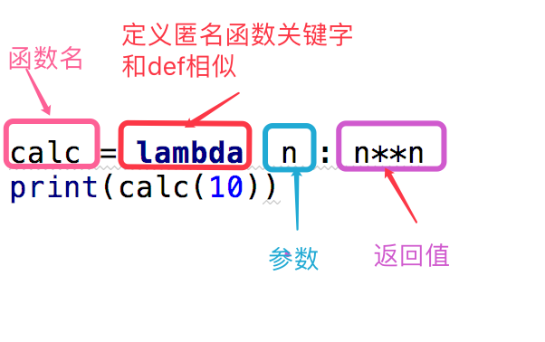

### 关键字

**查看所有关键字方式**

```python
import keyword
print(keyword.kwlist)
```

| 关键字   | 说明                                                         |
| -------- | ------------------------------------------------------------ |
| True     | 布尔值型,表示真                                              |
| False    | 布尔值型,表示假                                              |
| None     | 一个特殊的常量,None与False不同,是一个Nonetype对象            |
| def      | 定义函数的关键字                                             |
| class    | 定义类的关键字                                               |
| for      | 循环可以遍历任何序列的项目,如一个列表或者字符串              |
| if       | 用来检测一个条件是否为真的                                   |
| elif     | 和if配合使用的                                               |
| else     | 和if配合使用,当所有条件都不满足执行它                        |
| from     | 在python中使用import或from....import...来导入相应的模块      |
| import   | 在python中使用import或from....import...来导入相应的模块      |
| with     | python2.5以后有的,他实质是一个控制流语句,with可以简化try..finally语句,它主要用法是实现一个类的__enter__()和__exit__()方法 |
| as       | 取别名使用可以与import或with来结合使用                       |
| try      | 通常使用try....except语句来处理异常.通常的语句放在try中,而把错误语句放在except中 |
| except   | 和try配合使用,except语句用来铺垫异常的处理                   |
| finally  | 异常处理使用的关键字,用它可以指定最终执行的代码              |
| and      | 逻辑判断语句,and左右两边都为真,则判断结果为真,否则都是假     |
| is       | python中对象包含三要素:id,type,value 其中:id 用来唯一标识一个对象,type:标识对象的类型,value是对象的值 |
| or       | 逻辑判断,两边有一个为真,那么判断结果就为真                   |
| in       | for....in是另一个循环语句,它在一序列的对象上递归即逐一使用队列中的每个项目。 |
| not      | 逻辑判断语句,取反的意思                                      |
| pass     | 什么都不做,作用是弥补语法和空定义上的冲突，它的好处体现在代码的编写过程之中，比如你可以先写好软件的整个框架，然后再填好框架内具体函数和class的内容，如果没有pass编译器会报一堆的错误，让整个开发很不流畅。 |
| while    | while语句重复执行一块语句。while是循环语句的一种，while语句有一个可选的else从句。 |
| continue | continue语句被用来告诉Python跳过当前循环块中的剩余语句，然后继续进行下一轮循环。 |
| break    | break语句是用来终止循环语句                                  |
| return   | 函数返回值return                                             |
| yield    | 用起来像return,其实,yield是告诉程序,要求函数返回的是一个生成器 |
| del      | 删除列表或字典一个或多个元素                                 |
| global   | 定义全局变量                                                 |
| nonlocal | 关键字用来在函数或其他作用域使用外层(非全局)变量             |
| lambda   | 匿名函数,用来简化那些结构和逻辑简单的函数                    |
| assert   | 断言,检查条件是否正确,如果不正确就直接终止程序               |
| raise    | raise抛出异常                                                |

### 内置函数

查看所有内置函数 print(dir(__builtins__))

**常用内置函数**

| 函数                                    | 说明                                                         |
| --------------------------------------- | ------------------------------------------------------------ |
| **abs**()                               | 函数返回数字的绝对值                                         |
| **all**()                               | 判断给定的可迭代对象所有元素是否都为True,只要有一个不是那就返回False,元素除了0,空,False都算True |
| **any**()                               | 判断给定的可迭代参数都为False,那就返回False,如果有一个True,那就返回True |
| **ascii**()                             | 与repr类似,返回包含一个可打印表示的对象的字符串,如果是非ascii字符就会输出\x,\u或\U等字符表示 |
| **bin**()                               | 返回一个整数的二进制                                         |
| **bool**()                              | 判断True和False,0为False,1为True                             |
| **bytearray**()                         | 方法返回一个新字节数组。这个数组里的元素是可变的，并且每个元素的值范围: 0 <= x < 256。 |
| **bytes**()                             | 把数字或文字转换为bytes类型bytes('哈哈哈',encoding='utf-8')  |
| **callable**()                          | 检查一个对象是否可以被调用,如果返回True, object仍然可能调用失败；但如果返回False，调用对象ojbect绝对不会成功。  对于函数, 方法, lambda 函式, 类, 以及实现了 __call__ 方法的类实例, 它都返回 True。 |
| **chr**()                               | 返回括号中对应的ascii码                                      |
| **classmethod**                         | 类函数,使用方法 @classmethod def func2(cls):                 |
| **compile**                             | str = "for i in range(0,10): print(i)"       c = compile(str,'','exec')   # 编译为字节代码对象    exec(c) |
| **complex**()                           | 没什么用, 函数用于创建一个值为 real + imag * j 的复数或者转化一个字符串或数为复数。如果第一个参数为字符串，则不需要指定第二个参数。。 |
| **copyright**                           | 翻译: 交互式提示对象，用于打印许可文本、列表,贡献者和版权声明。 |
| **credits**                             | 翻译: 交互式提示对象，用于打印许可文本、列表贡献者和版权声明。 |
| **delattr**()                           | 函数用于删除属性 delattr(x, 'foobar') 相等于 del x.foobar。  |
| **dict**()                              | 函数用于创建一个字典,返回一个字典                            |
| **dir**()                               | 函数不带参数时，返回当前范围内的变量、方法和定义的类型列表；带参数时，返回参数的属性、方法列表 , 如果参数包含方法__ dir __ ()，该方法将被调用。如果参数不包含__ dir __()，该方法将最大限度地收集参数信息。 |
| **divmod**()                            | 函数把除数和余数运算结果结合起来，返回一个包含商和余数的元组(a // b, a % b) |
| **enumerate**()                         | 函数将一个可遍历对象,组合成一个索引序列,返回数据和数据的下标 |
| **eval**()                              | 函数用来执行一个字符串表达式，并返回表达式的值。eval("3*6") 会返回18 |
| **exec**()                              | 和eval类似,但是可以执行更复杂的python代码eval("""for i in range(10):print(i)""") |
| **exit**()                              | 退出程序                                                     |
| <font color=red>**filter**()</font>     | filter()函数用于过滤序列,guolv掉不符合条件的元素, 返回由符合条件元素组成的新列表。 有两个参数:**第一个为函数**,**第二个为序列** |
| **float**()                             | 把一个整数或字符串转换为一个浮点型                           |
| **format**()                            | 格式化字符串,[具体使用请看](https://www.cnblogs.com/benric/p/4965224.html) |
| **frozenset**()                         | 返回一个冻结的集合，冻结后集合不能再添加或删除任何元素。 使其变为一个可哈希元素 |
| <font color=red>**getattr**()</font>    | 函数用于返回一个对象属性值。                                 |
| <font color=red>**globals**()</font>    | 函数会以字典类型返回当前位置的全部全局变量                   |
| <font color=red>**hasattr**()</font>    | 判断对象是否包含对应的属性,返回True和False                   |
| **hash**()                              | 用于获取一个对象(字符串或数值)的哈希值                       |
| **help**()                              | 函数用于查看函数或模块用途的详细说明                         |
| **hex**()                               | 将10进制转换为16进制                                         |
| <font color=red>**id**()</font>         | 函数用于获取对象的内存地址                                   |
| **input**()                             | 接收一个标准输入数据,返回为string类型                        |
| **int**()                               | 把对象装换为整数类型                                         |
| <font color=red>**isinstance()**</font> | 判断一个实例对象与类的关系                                   |
| **issubclass**()                        | 函数判断类与类的关系                                         |
| **iter**()                              | 用来生成一个迭代器                                           |
| **len**()                               | 计算元素个数的列表                                           |
| **license**()                           | 没用, 交互式提示对象，用于打印许可文本、列表,贡献者和版权声明 |
| **list**()                              | 返回一个列表                                                 |
| **locals**()                            | 函数会以字典类型返回当前位置的全部局部变量。                 |
| <font color=red>**map()**</font>        | 会根据提供的函数对指定序列做映射。 返回值是迭代器            |
| **max**()                               | 返回给定参数的最大值,参数可以为序列                          |
| **min**()                               | 返回给定参数的最小值,参数可以为序列                          |
| **memoryview**()                        | 函数返回给定参数的内存查看对象(Momory view)。  所谓内存查看对象，是指对支持缓冲区协议的数据进行包装，在不需要复制对象基础上允许Python代码访问。 |
| **next**()                              | 返回迭代器的下一个项目                                       |
| **object()**                            | 初始化函数                                                   |
| **oct**()                               | 将一个整数装换为8进制                                        |
| **open()**                              | 函数用于打开一个文件，创建一个 file 对象，相关的方法才可以调用它进行读写。 |
| **ord**()                               | 把ascii码对应的数字                                          |
| **pow()**                               | 求x的y次方pow(x,y)                                           |
| **print**()                             | 打印                                                         |
| **property**()                          | 把类方法变为一个属性:@property @x.setter 和@x.deleter        |
| **quit()**                              | 退出                                                         |
| **range**()                             | 函数可创建一个整数列表,一般用在for循环中                     |
| **repr()**                              | 函数将对象转化为供解释器读取的形式,返回一个string            |
| **reversed**()                          | 翻转,返回一个反转的迭代器                                    |
| **round**()                             | 返回浮点数x的四舍五入值,round( 122.00056,3 )返回122.0        |
| **set**()                               | 创建一个集合                                                 |
| **setattr**()                           | 设置属性和值  setattr(a, 'bar', 5)                           |
| **slice**()                             | 函数实现切片对象，主要用在切片操作函数里的参数传递           |
| **sorted**()                            | 函数对所有可迭代的对象进行排序操作                           |
| @**staticmethod**                       | 设置一个静态类方法                                           |
| **str**()                               | 装换为字符串类型                                             |
| **sum**()                               | 对序列进行求和计算                                           |
| **super()**                             | 执行他的上一层继承对象.mro,                                  |
| **tuple()**                             | 转换为元祖类型                                               |
| **type()**                              | 返回这个对象的类型                                           |
| **vars()**                              | 函数返回对象object的属性和属性值的字典对象。                 |
| <font colo r=red>**zip**()</font>       | 函数用于将可迭代的对象作为参数，将对象中对应的元素打包成一个个元组，然后返回由这些元组组成的列表。如果各个迭代器的元素个数不一致，则返回列表长度与最短的对象相同，利用 * 号操作符，可以将元组解压为列表。 |
| <font colo r=red>**reduce**()</font>    | 函数会对参数序列中的元素进行累积                             |

### 下划线的方法

| 函数名            | 说明                              |
| ----------------- | --------------------------------- |
| __ build_class __ | 未知                              |
| __ debug __       | 未知                              |
| __ doc __         | 查看类的说明或详情                |
| __ import __      | 函数用于动态加载类和函数 。       |
| __ loader __      | 未知                              |
| __ name __        | 如果在当前文件运行,返回__ main __ |
| __ package __     | 未知,返回一个None                 |
| __ spec __        | 未知                              |

### 报错函数

有时间整理:'ArithmeticError', 'AssertionError', 'AttributeError', 'BaseException', 'BlockingIOError', 'BrokenPipeError', 'BufferError', 'BytesWarning', 'ChildProcessError', 'ConnectionAbortedError', 'ConnectionError','ConnectionRefusedError', 'ConnectionResetError','DeprecationWarning', 'EOFError', 'Ellipsis','EnvironmentError', 'Exception', 'False', 'FileExistsError','FileNotFoundError', 'FloatingPointError', 'FutureWarning', 'GeneratorExit', 'IOError', 'ImportError', 'ImportWarning','IndentationError', 'IndexError', 'InterruptedError', 'IsADirectoryError','KeyError', 'KeyboardInterrupt', 'LookupError', 'MemoryError', 'ModuleNotFoundError', 'NameError', 'None', 'NotADirectoryError', 'NotImplemented', 'NotImplementedError', 'OSError', 'OverflowError', 'PendingDeprecationWarning', 'PermissionError', 'ProcessLookupError', 'RecursionError', 'ReferenceError', 'ResourceWarning', 'RuntimeError', 'RuntimeWarning', 'StopAsyncIteration', 'StopIteration', 'SyntaxError','SyntaxWarning', 'SystemError', 'SystemExit', 'TabError', 'TimeoutError','True', 'TypeError', 'UnboundLocalError', 'UnicodeDecodeError', 'UnicodeEncodeError', 'UnicodeError', 'UnicodeTranslateError', 'UnicodeWarning', 'UserWarning', 'ValueError', 'Warning', 'WindowsError', 'ZeroDivisionError'

### 匿名函数



### 递归函数

```python
import sys
print(sys.setrecursionlimit(100000))  设置最大递归深度
递归需要有一个终止条件
def age(n):
    if n == 1:
        return 40
    else:
        return age(n-1)+2

print(age(4))
```

### 偏函数

```python
from functools import partial 
def xx(n,x):
    print(n,x)
aa = partial(xx,11)
偏函数是自己给他添加一个值
```

