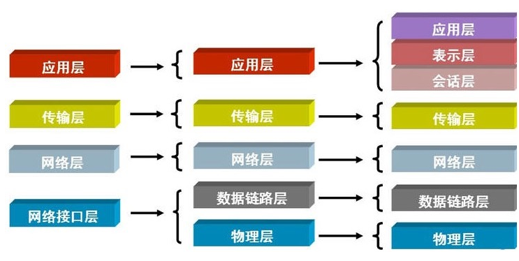
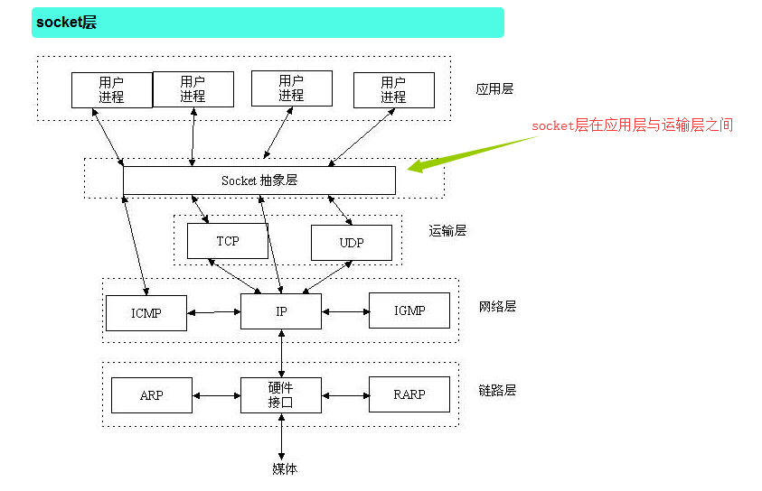
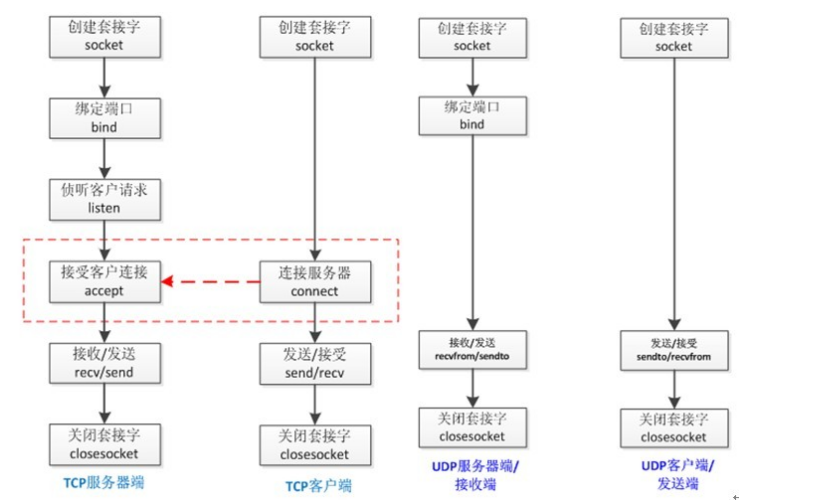

### 什么是架构

- 1.根据要解决的问题，对目标系统的边界进行界定。
- 2.并对目标系统按某个原则的进行切分。切分的原则，要便于不同的角色，对切分出来的部分，并行或串行开展工作，一般并行才能减少时间。
- 3.并对这些切分出来的部分，设立沟通机制。
- 根据3，使得这些部分之间能够进行有机的联系，合并组装成为一个整体，完成目标系统的所有工作

### C/S架构和B/S架构

- 1.C/S架构
	- C/S即：Client与Server ，中文意思：客户端与服务器端架构，这种架构也是从用户层面（也可以是物理层面）来划分的。
- 2.B/S架构
	- B/S即：Browser与Server,中文意思：浏览器端与服务器端架构，这种架构是从用户层面来划分的。

### 什么是ip地址？

- IP地址是指互联网协议地址，IP地址是一个32位的二进制数，IP地址通常用“点分十进制”表示

### 什么是端口

- 设备与外界通讯交流的出口。

**ip地址负责精确到电脑，端口负责精确到程序**

**mac地址:mac地址是12位十六进制组成:物理地址,全球唯一**

arp协议:通过目标ip地址获得目标mac地址 

### OSI七层模式

### socket概念

### tcp和udp协议

TCP（Transmission Control Protocol）

- 可靠的、面向连接的协议（eg:打电话）、传输效率低全双工通信（发送缓存&接收缓存）、面向字节流。使用TCP的应用：Web浏览器；电子邮件、文件传输程序。

UDP（User Datagram Protocol）

- 不可靠的、无连接的服务，传输效率高（发送前时延小），一对一、一对多、多对一、多对多、面向报文，尽最大努力服务，无拥塞控制。使用UDP的应用：域名系统 (DNS)；视频流；IP语音(VoIP)。

### 模块socket

1.**socket.socket(family=AF_INET, type=SOCK_STREAM, proto=0, fileno=None) 创建套接字**

- 参数:
	- family(地址族)
		- AF_UNIX:采用文件类型通信的套接字
		- AF_INET:使用IP v4:采用网络形式通信的套接字
		- AF_INET6: 使用IPv6
	- type:设置采用什么协议
		- socket.SOCK_STREAM:TCP套接字类型
		- socket.SOCK_DGRAM:UDP套接字类型
		- socket.SOCK_RAW:原始套接字类型,这个套接字比较强大,创建这种套接字可以监听网卡上的所有数据帧
		- socket.SOCK_RDM:是一种可靠的UDP形式,即保证交付数据报但不保证顺序,SOCK_RAM用来提供对原始协议的低级访问，在需要执行某些特殊操作时使用，如发送ICMP报文。SOCK_RAM通常仅限于高级用户或管理员运行的程序使用

**2.socket.bind(address):将socket绑定到地址(常用于服务端)**

- address地址的格式取决于地址族,在AF_INET下,以元组(host,port)形式表现

**3.socket.listen([backlog]):启动服务器以接受连接(常用于服务端)**

- backlog>=0, 指定系统在拒绝新连接之前允许的未接受连接的数量,如果没指定,则选择默认呢的合理值

**4.socket.accept():接收一个连接,该socket必须绑定一个地址和监听连接,返回值是一对(conn,address)(常用于服务端)**

- conn是socket对象,可以在该连接上发送和接收数据,address是连接另一端的地址

**5.socket.recv(bufsize,[flags]):从socket接收数据,返回值是一个代表所收到数据的字节对象(TCP)**

- 一次性接收的最大数量是由bufsize指定,参数flags通常忽略

**5.5 socket.recvfrom(bufsize,[flags])(UDP)**

- 返回一个bytes类型的字符串,和一个对方的ip地址和端口号

**6.socket.send(data,[flags]):将数据发送到socket(TCP)**

- python3中通常只能发送bytes类型

**6.5 socket.sendto(内容,地址)(UDP)**

- 有两个参数:1要给对方传输的内容,2.对方的ip地址和端口

**7.socket.connect(address):连接到远程socket(常用于客户端)**

- 如果连接被信号中断，则该方法等待直到连接完成，或者如果信号处理程序没有引发异常并且套接字正在阻塞或者已经阻塞，则在超时时引入socket.timeout超时。对于非阻塞套接字，如果连接被信号中断（或由信号处理程序引发的异常），则该方法引发InterruptedError异常。

**8.socket.close()**           

- 注：被调用后，连接断开，socket不能在发送数据，连接另一端也将不在接收数据。

**其他**

- 1.**setblocking**(True) 阻塞
	- 默认是阻塞状态的
- 2.**setblocking**(False) 非阻塞
	- 不阻塞程序的运行
- 3.**settimeout**(int)    针对阻塞状态,设置一个延时等待
	- int是要阻塞的秒数,需要在这个时间内接受到内容,接收不到会报错
- 4.**gettimeout**()       获得延时的时间
	- 获取阻塞的时间,这个时间是自己设定的
- 5.**sk**.**setsockopt**(socket.SOL_SOCKET,socket.SO_REUSEADDR,1)重启端口(服务器可以多开)

### 粘包

- **就是因为接收端不知道如何接收数据,造成接收数据的混乱的问题只发生在tcp协议上.**
- 因为tcp协议的特点是面向数据流形式的传输粘包的发生主要是因为**tcp协议有两个机制: 合包机制(nagle算法),拆包机制**

