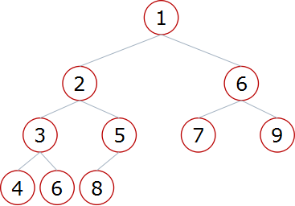
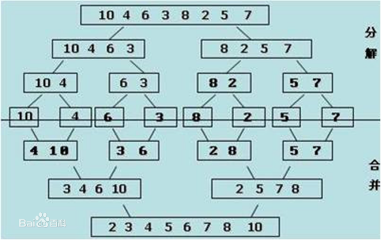
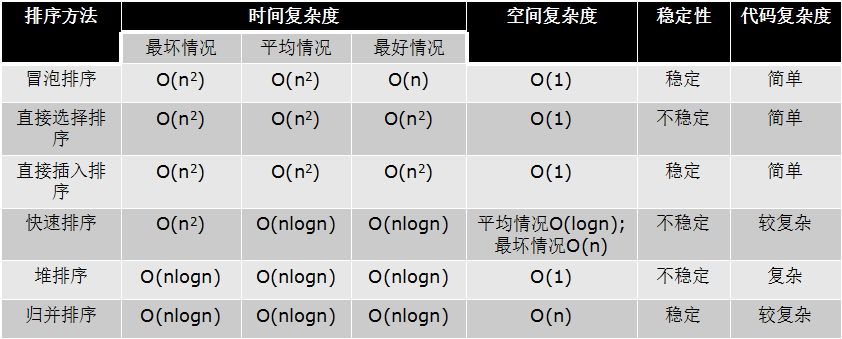

## 什么是算法?

**算法(Algorithm):**一个计算过程,解决问题的方法

### 时间复杂度

- **时间复杂度** :用来评估算法运行效率的一个东西
- 一般来说,时间复杂度高的算法比时间复杂度低的算法慢
- 常见的时间复杂度(按照效率排序
  	- O(1)<O(logn)<O(n)<O(nlogn)<O(n2)<O(n2logn)<O(n3)
- 不常见的时间复杂度
  	- O(n!) O(2n) O(nn)....
- 如何一眼判断时间复杂度
  	- **循环减半的过程O(logn)**
  	- **几次循环就是n的几次方的复杂度**

```python
print('hello World')				# O(1)
for i in range(n):					# O(n)
    print('hello world')
for i in range(n):					#O(n²)
    for j in range(n):
		print('hello world')
for i in range(n):					#O(n³)
    for j in range(n):
        for k in range(n):
			print('hello world')
 
```

### 空间复杂度

**空间复杂度:** 用来评估算法内存占用大小的一个式子


##  二分查找

**代码:**

```python
# 普通的查找方式
def linear_search(data_set,value):
    for i in range(len(data_set)):			# 时间复杂度是O(n)
        if data_set[i] == value:
            return i
     return 
```

```python
# 二分查找
# 循环版本
def bin_search(data_set,value):
    low = 0
    high = len(data_set) - 1
    while low <= high:
        mid = (low + high) // 2
        if data_set[mid] == value:			# 时间复杂度O(logn)
            return mid
        elif data_set[mid] > value:
            high = mid-1
        else:
            low = mid + 1

# 递归版本
def bin_search_rec(data_set,value,low,high):
    if low <= high:
        mid = (low + high) // 2
        if data_set[mid] == value:
            return mid
        elif data_set[mid] > value:
            return bin_search_rec(data_set,value,low,mid-1)
        else:
            return bin_search_rec(data_set,value,mid+1,high)
    else:
        return
```

## 冒泡排序

**冒泡排序思路:** 首先,列表两个相邻的数,如果前边的比后边的大,那么交换这两个数,如果不大,那就不需要交换

**代码关键点:** 1.趟  2.无序区 

	```python
	# 冒泡算法 时间复杂度:O(n²)
	def bubble_sort(li):
	    for i in range(len(li)):
	        for j in range(i+1,len(li)):
	            if li[i] > li[j]:
	                li[i], li[j] = li[j], li[i]
	# 冒泡算法优化
	# 如果冒泡排序中执行一趟而没有交换，则列表已经是有序状态，可以直接结束算法
	def bubble_sort(li):
	    for i in range(len(li)):
	        exchange = False
	        for j in range(i+1,len(li)):
	            if li[i] > li[j]:
	                li[i], li[j] = li[j], li[i]
	                exchange = True
			if not exchange:
	            return   
	```


## 选择排序

**选择排序思路:** 

- 一趟遍历记录最小的数放在第一个位置
	
- 再一趟遍历记录剩余列表中最小的数，继续放置

**代码关键点:** 1.无序区 2.最小数的位置

```python
# 选择排序代码  时间复杂度:O(n²)
def select_sort(li):
    for i in range(len(li)):
        min_loc = i
        for j in range(i+1,len(li)):
            if li[j] < li[min_loc]:
                min_loc = j
         if min_loc != i:
            li[i],li[min_loc] = li[min_loc],li[i]
```

## 插入排序

**插入排序思路**

​	列表被分为有序区和无序区两部分,最初有序区只有一个元素

​	每次从无序区选择一个元素,插入到有序区的位置,直到无序区变空

```python
# 插入排序代码  时间复杂度O(n²)
def insert_sort(li):
    for i in range(1,len(li)):
        tmp = li[i]
        j = i - 1
        while j>=0 and tmp < li[j]:
            li[j+1] = li[j]
            j -= 1
        li[j+1] = tmp
```

## 快速排序

**快速排序思路**

1.取一个元素p(第一个元素),使元素p归为

2.列表被p分为两部分,左边比p小,右边比p大

3..递归完成排序

```python
# 快速排序   时间复杂度O(nlogn)
def quick_sort(data,left,right):
	if left < right:
        mid = partition(data,left,right)
        quick_sort(data,left,mid-1)
        quick_sort(data,mid+1,right)
def partition(data,left,right):
    tmp = data[left]
    while left < right:
        while left < right and data[right] >= tmp:
            right -= 1
        data[left] = data[right]
        while left < right and data[left] <= tmp:
            left += 1
        data[right] = data[left]
    data[left] = tmp
    return left
```

## 堆排序

**树与二叉树的简介**

树是一种数据结构          比如：目录结构

树是一种可以递归定义的数据结构

树是由n个节点组成的集合：

- 如果n=0，那这是一棵空树；
- 如果n>0，那存在1个节点作为树的根节点，其他节点可以分为m个集合，每个集合本身又是一棵树。

一些概念:

- 根节点、

- 叶子节点树的深度（高度）

- 树的度孩子节点/父节点

- 子树

**两种特殊二叉树**

- 满二叉:一个二叉树，如果每一个层的结点数都达到最大值，则这个二叉树就是满二叉树。

- 完全二叉树：叶节点只能出现在最下层和次下层，并且最下面一层的结点都集中在该层最左边的若干位置的二叉树。

**二叉树的存储方式:**

- 链式存储方式
- 顺序存储方式(列表)
- 父节点和左孩子节点的编号下标有什么关系？   2i+1  i:代表下标
- 父节点和右孩子节点的编号下标有什么关系？   2i+2

**堆排序**

**堆:**

- 大根堆：一棵完全二叉树，满足任一节点都比其孩子节点大


- 小根堆：一棵完全二叉树，满足任一节点都比其孩子节点小



**堆的向下调整性质:**

假设:节点的左右子树都是堆，但自身不是堆

当根节点的左右子树都是堆时，可以通过一次向下的调整来将其变换成一个堆

**堆排序过程:**

1. 建立堆
2. 得到堆顶元素，为最大元素
3. 去掉堆顶，将堆最后一个元素放到堆顶，此时可通过一次调整重新使堆有序。
4. 堆顶元素为第二大元素。
5. 重复步骤3，直到堆变空。

```python
# 堆排序代码   时间复杂度O(nlogn)
def sift(data,low,high):
    i = low
    j = 2 * i +1
    tmp = data[i]
    while j <= high:
        if j < high and data[j] < data[j+1]:
            j += 1
         if tmp < data[j]:
            data[i] = data[j]
            i = j
            j = 2*i+1
         else:
            break
    data[i] = tmp
    
def heap_sort(data):
    n = len(data)
    for i in range(n//2-1,-1,-1):
        sift(data,i,n-1)
    for i in range(n-1,-1,-1):
        data[0],data[i] = data[i],data[0]
        sift(data,0,i-1)
```

**堆排序--内置模块**

- 优先队列：一些元素的集合，POP操作每次执行都会从优先队列中弹出最大（或最小）的元素。
- 堆——优先队列
- Python内置模块——heapq
	- heapify(x)
	- heappush(heap, item)
	- heappop(heap)
- 利用heapq模块实现堆排序

```python
import heapq
def heapsort(li): 
    h = [] 
    for value in li:   
        heappush(h, value)
    return [heappop(h) for i in range(len(h))]

```

## 归并排序

假设现在的列表分两段有序，将其合成为一个有序列表,这种操作称为一次归并

```python
# 归并排序 时间复杂度O(logn) 空间复杂度:O(n)
def merge(li,low,mid,high):
    li_tmp = []
    i = low
    j = mid + 1
    while i <= mid and j <= high:
        if li[i] < li[j]:
            li_tmp.append(li[i])
            i += 1
        else:
            li_tmp.append(li[j])
            j += 1
    while i <= mid:
        li_tmp.append(li[i])
        i += 1
    while j <= high:
        li_tmp.append(li[j])
        j += 1
    for i in  range(len(li_tmp)):
        li[i+low] = li_tmp[i]

def merge_sort(li,low,high):
    if low < high:
        mid = (low + high) // 2
        merge_sort(li,low,mid)
        merge_sort(li,mid+1,high)
        merge(li,low,mid,high)
```

**归并排序实现思路:**



- 分解：将列表越分越小，直至分成一个元素。
- 终止条件：一个元素是有序的。
- 合并：将两个有序列表归并，列表越来越大

**总结:**

一般情况下，就运行时间而言：快速排序 < 归并排序 < 堆排序

三种排序算法的缺点：

- 快速排序：极端情况下排序效率低
- 归并排序：需要额外的内存开销
- 堆排序：在快的排序算法中相对较慢



## 希尔排序

**希尔排序思路:**

- 希尔排序是一种分组插入排序算法
- 首先取一个整数d1=n/2，将元素分为d1个组，每组相邻量元素之间距离为d1，在各组内进行直接插入排序
- 取第二个整数d2=d1/2，重复上述分组排序过程，直到di=1，即所有元素在同一组内进行直接插入排序。
- 希尔排序每趟并不使某些元素有序，而是使整体数据越来越接近有序；最后一趟排序使得所有数据有序

```python
# 希尔排序 希尔排序的时间复杂度讨论比较复杂，并且和选取的gap序列有关。
def shell_sort(li):
    gap = len(li) // 2
    while gap > 0:
        for i in range(gap,len(li)):
            tmp = li[i]
            j = i-gap
            while j >= 0 and tmp < li[j]:
                li[j + gap] = li[j]
                j -= gap
            li[j+gap] = tmp
        gap //= 2

```

## 计数排序

现在有一个列表，已知列表中的数范围都在0到100之间。设计算法在O(n)时间复杂度内将列表进行排序。

创建一个列表，用来统计每个数出现的次数

```python
def count_sort(li,max_num):
    count = [0 for i in range(max_num+1)]
    for num in li:
        count[num] += 1
    i = 0
    for num , m in enumerate(count):
        for j in range(m):
            li[i] = num
            i += 1
li = [1,2,3,4,5,8,6,3,2,1,4]
count_sort(li,8)
print(li)
```

## 桶排序

- 在计数排序中，如果元素的范围比较大（比如在1到1亿之间），如何改造算法？
- 桶排序(Bucket Sort)：首先将元素分在不同的桶中，在对每个桶中的元素排序。
- 桶排序的表现取决于数据的分布。也就是需要对不同数据排序时采取不同的分桶策略。
- 平均情况时间复杂度：O(n+k)
- 最坏情况时间复杂度：O(n2k)
- 空间复杂度：O(nk)

## 基数排序

- 多关键字排序：加入现在有一个员工表，要求按照薪资排序，年龄相同的员工按照年龄排序。
- 先按照年龄进行排序，再按照薪资进行稳定的排序。
- 对32,13,94,52,17,54,93排序，是否可以看做多关键字排序？

```python
# 基数排序  
# 时间复杂度 O(kn)
# 空间复杂度:O(k+n)
# k表示数字位数
def list_to_bucket(li, i):
    buckets = [[] for _ in range(10)]
    for val in li:
        digit = val // (10 ** i) % 10
        buckets[digit].append(val)
    return buckets

def bucket_to_list(buckets):
    li = []
    for bucket in buckets:
        for val in bucket:
            li.append(val)
    return li

def radix_sort(li):
    max_val = max(li) 
    i = 0
    while 10 ** i <= max_val:
        li = bucket_to_list(list_to_bucket(li, i))
        i += 1
    return li

```

