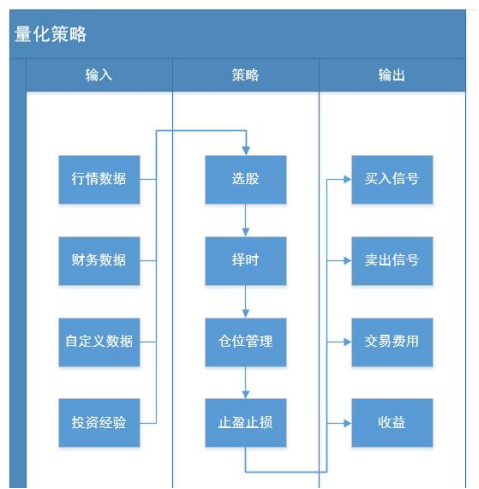

### 金融量化和分析

**金融:**就是对现有资源进行重新整合之后，实现价值和利润的等效流通。

**金融工具**：在金融市场中可交易的金融资产。

- 股票
- 期货
- 黄金
- 外汇
- 基金

### 股票

**股票**是股份公司发给出资人的一种凭证，股票的持有者就是股份公司的股东

**上市**

- 企业通过证券交易所公开向社会增发股票以募集资金

**股票作用**

- 出资证明、证明股东身份、对公司经营发表意见
- 公司分红、交易获利

**股票的分类**

- 股票按业绩分类
	- 蓝筹股：资本雄厚、信誉优良的公司的股票
	- 绩优股：业绩优良公司的股票
	- ST股：特别处理股票，连续两年亏损或每股净资产低于股票面值
- 股票按上市地区分类
	- A股：中国大陆上市，人民币认购买卖（T+1，涨跌幅10%）
	- B股：中国大陆上市，外币认购买卖（T+1，T+3）
	- H股：中国香港上市（T+0，涨跌幅不设限制）
	- N股：美国纽约上市
	- S股：新加坡上市

**股票市场的构成**

- 上市公司
- 投资者（包括机构投资者）
- 证监会、证券业协会、交易所
- 证券中介机构

**交易所**

- 上海证券交易所：只有一个主板（沪指）
- 深圳证券交易所：
	- 主板：大型成熟企业（深成指）
	- 中小板：经营规模较小
	- 创业板：尚处于成长期的创业企业

**影响股价的因素**

- **公司自身因素**：股票自身价值是决定股价最基本的因素，而这主要取决于发行公司的经营业绩、资信水平以及连带而来的股息红利派发状况、发展前景、股票预期收益水平等。
- **行业因素：**行业在国民经济中地位的变更，行业的发展前景和发展潜力，新兴行业引来的冲击等，以及上市公司在行业中所处的位置，经营业绩，经营状况，资金组合的改变及领导层人事变动等都会影响相关股票的价格。
- **市场因素**：投资者的动向，大户的意向和操纵，公司间的合作或相互持股，信用交易和期货交易的增减，投机者的套利行为，公司的增资方式和增资额度等，均可能对股价形成较大影响。
- **心理因素**：情绪波动，判断失误，盲目追随大户、狂抛抢购
- **经济因素**：经济周期，国家的财政状况，金融环境，国际收支状况，行业经济地位的变化，国家汇率的调整等
- **政治因素**

**股票买卖**

**委托买卖股票**

- 个人不能直接买卖，需要在券商开户，进行委托购买

股票交易日：周一到周五（非法定节假日和交易所休市日）

**股票交易时间**：

- 9:15-9:25	开盘集合竞价时间
	 9:30-11:30	前市，连续竞价时间
	 13:00-14:57	后市，连续竞价时间
	 14:57-15:00	收盘集合竞价时间

T+1交易制度：股票买入后当天不能卖出，要在买入后的下一个交易日才能卖出

涨停、跌停限制

股票购买方式：市价单、限价单

### 金融分析

- **基本分析面分析**
	- 宏观经济面分析：国家的财政政策、货币政策等
	- 行业分析
	- 公司分析：财务数据、业绩报告等
- 技术面分析：各项技术指标
	- K线
	- MA（均线）
	- KDJ（随机指标）
	- MACD（指数平滑移动平均线）

### k线

### 金融量化投资

**量化投资:**利用计算机技术并且采用一定的数学模型去实践投资理念，实现投资策略的过程。

**量化投资的优势**

- 避免主观情绪、人性弱点和认知偏差，选择更加客观
- 能同时包括多角度的观察和多层次的模型
- 及时跟踪市场变化，不断发现新的统计模型，寻找交易机会
- 在决定投资策略后，能通过回测验证其效果

### 量化策略

**量化策略**：通过一套固定的逻辑来分析、判断和决策，自动化地进行股票交易。

**核心内容**

- 选股
- 择时
- 仓位管理
- 止盈止损

**策略周期**

- 产生想法/学习知识
- 实现策略：Python
- 检验策略：回测/模拟交易
- 实盘交易
- 优化策略/放弃策略

